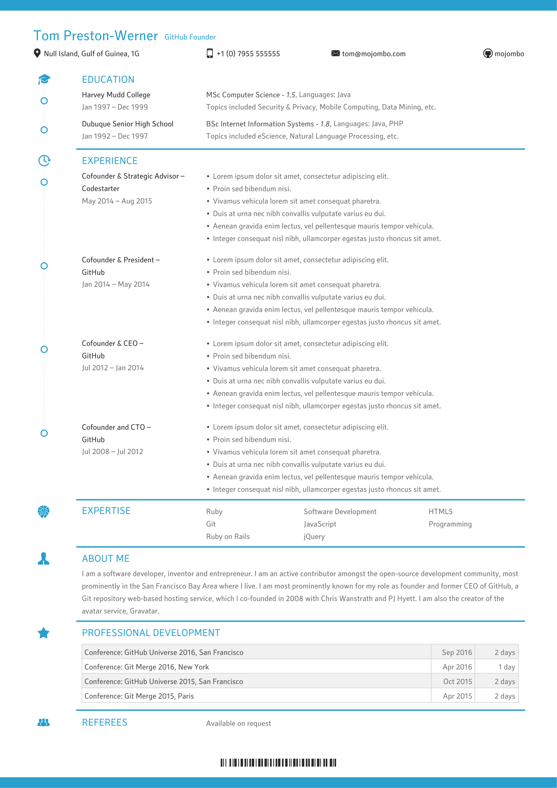

## Setup

1. Ensure the latest version of [Composer](https://getcomposer.org/download/) is installed
1. Proceed with running the following command from a command prompt in the base of the repo folder

    ```sh
    $ composer update
    ```

1. To generate the PDF view `make.php` in a browser running your local PHP server
  - e.g. `http://localhost/cv/`

--

## FAQs

- See [Wiki](https://github.com/u01jmg3/cv/wiki/FAQs)

--

<kbd>

</kbd>